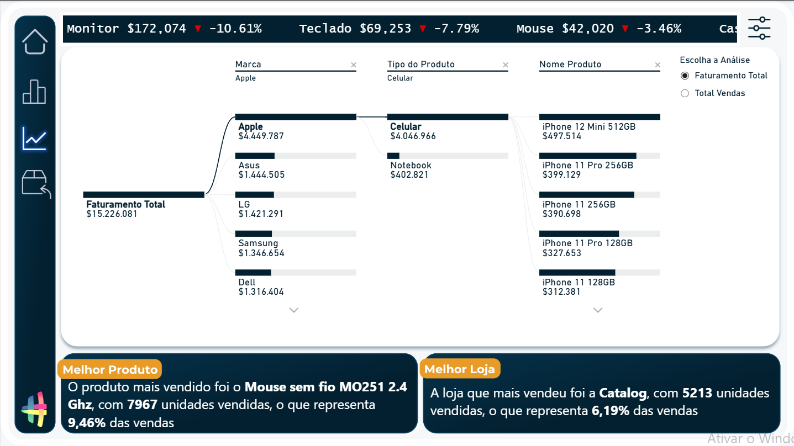
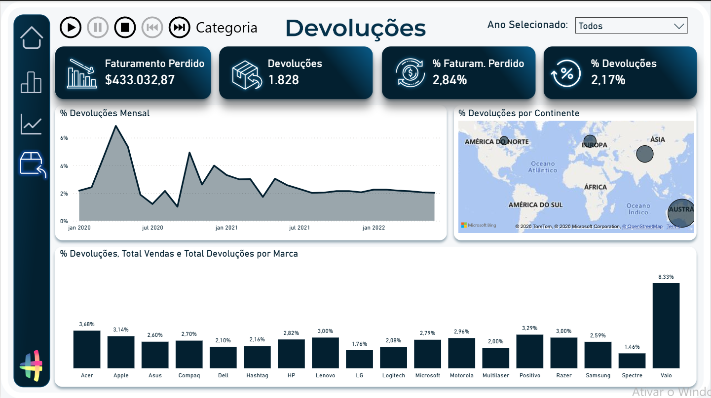

# 📊 Sales Analytics Dashboard

An interactive Power BI dashboard developed during a practical Business Intelligence training program to analyze sales performance through dynamic KPIs, interactive reports, and business insights.

---

# 📖 About the Project

This project was developed as part of a hands-on Power BI training program with the goal of applying Business Intelligence concepts in a realistic business scenario.

Throughout the project, I worked on data modeling, Power Query transformations, DAX measures, interactive visualizations, and dashboard design to transform raw sales data into meaningful business insights.

Although the dataset and business scenario were provided during the training, this repository demonstrates the technical skills acquired and applied throughout the development process.

---

# 🎯 Business Objective

Build an interactive dashboard capable of monitoring sales performance, profitability, product performance, and returns, allowing users to explore the data through interactive reports and support business decision-making.

---

# 🚀 Dashboard Features

- Executive sales overview
- Revenue, Profit and Margin KPIs
- Year-over-Year comparison
- Sales analysis by product
- Sales analysis by continent
- Sales analysis by store type
- Product Drillthrough pages
- Returns analysis
- Interactive filters and slicers
- Dynamic tooltips
- Bookmarks and page navigation

---

# 🛠️ Technologies Used

- Power BI Desktop
- Power Query
- DAX
- Microsoft Excel

---

# 📈 Business KPIs

- Total Revenue
- Total Profit
- Total Sales
- Profit Margin
- Revenue by Product
- Revenue by Continent
- Sales by Store Type
- Return Rate
- Revenue Lost from Returns

---

# 🖼️ Dashboard Preview

## Executive Overview

---

## Product Analysis

---

## Product Drillthrough

---

## Returns Analysis

---

# 📂 Repository Contents

- Power BI report (.pbix)
- Excel datasets
- Supporting project files
- Dashboard screenshots
- README

---

# ▶️ Getting Started

1. Clone or download this repository.
2. Open the `.pbix` file using **Power BI Desktop**.
3. If necessary, update the data source paths.
4. Refresh the data.

---

# 💼 Skills Demonstrated

- Business Intelligence
- Dashboard Design
- Data Modeling
- Data Transformation
- Power Query
- DAX
- KPI Development
- Interactive Data Visualization
- Business Storytelling

---

# 🙏 Acknowledgements

This project was developed during a practical Power BI training program using educational datasets and business scenarios provided as part of the course.

The purpose of this repository is to demonstrate the Business Intelligence techniques and analytical skills developed throughout the project.

---

# 👩‍💻 Author

**Andressa Grazioli**

**Data Analyst | Business Intelligence**

📧 andressagrazioli@outlook.com

💼 www.linkedin.com/in/andressagamorim-data-analyst/
💼 www.linkedin.com/in/andressagamorim-data-analyst/
